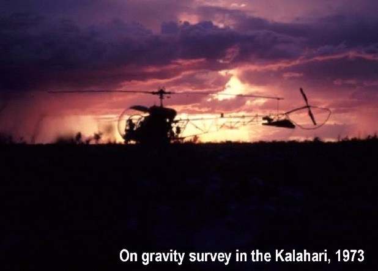
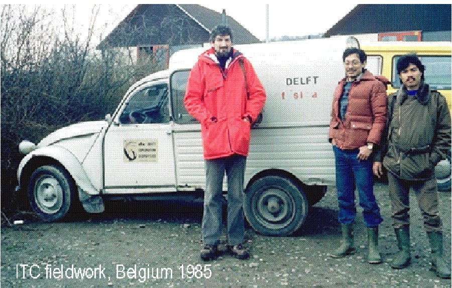
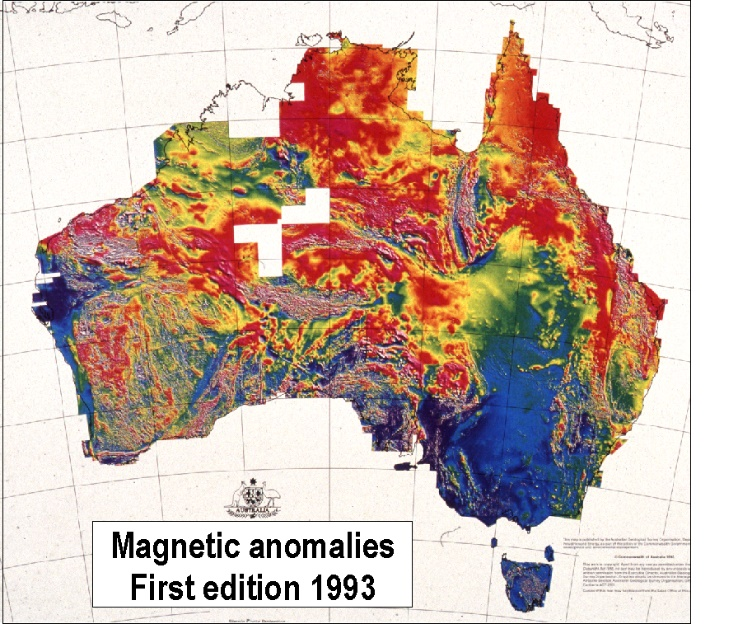
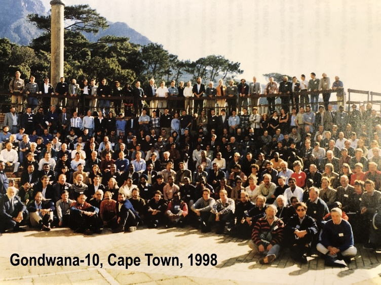
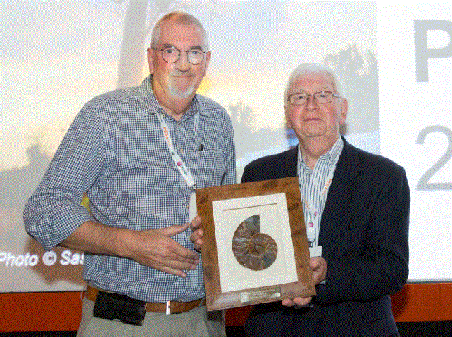

## Short curriculum vitae

**Colin Reeves** has been involved since 1970 with the application of (airborne)
geophysical mapping to support geological reconnaissance and resource
exploration in the southern hemisphere. He holds degrees from
Cambridge, Birmingham and Leeds universities in England and started
his professional career with the Geological Survey of Botswana in 1970
where he planned and executed the first national gravity survey
coverage over a five-year period. From 1976 to 1983 he lived in
Canada, working first for Geoterrex Limited in Ottawa and then
Paterson, Grant and Watson Limited (PGW) in Toronto. He interpreted
the initial CIDA aeromagnetic coverage of the Kalahari in Botswana
before spending time on similar projects in Brazil, Côte d’Ivoire, the
South China Sea, Tanzania, Kenya and Burundi. He became a director of
PGW and, with Ian MacLeod, co-founded Geosoft® in this period.

In 1983 he moved to Delft, The Netherlands, where he was appointed
Professor in Exploration Geophysics at the International Institute for
Aerial Survey and Earth Sciences (ITC) as it was then. He took charge
of postgraduate and MSc courses in exploration geophysics for students
almost exclusively from Africa, Asia and Latin America. Some 250
students, including over 50 research MScs, passed through his division
over 20-plus years, many of whom now hold senior positions in their
own countries and the wider world.

He continued with consulting projects, mostly in Africa and India, as
part of his ITC duties. He initiated the digital compilation of all
aeromagnetic data for the whole of Africa (AMMP), Arabia, India and
the Middle East (AAIME), 1989-1999. He accepted an invitation from the
Government of Australia to head the geophysical mapping programme of
the Australian Geological Survey Organisation (now Geoscience
Australia) during a two-year leave of absence, 1991-3. In Canberra he
supervised, inter alia, the production of the first magnetic and
gravity anomaly images of all Australia. On returning to ITC,
development projects included the introduction of GIS techniques to
geological surveys in Africa and India (Geodesa, Indigeo), 1993-2002.

In 1993 he was elected as head of the Delft Location of ITC and then,
in 1996, to the chairmanship of the Department of Earth Resources
Surveys. He served internationally as chairman of Division V
(Instruments, Observatories, Surveys and Analyses) for the
International Association for Geomagnetism and Aeronomy (IAGA) from
1995 to 1999. He was for many years an active member (including
chairman, 1991 to 1995) of IAGA’s working group Magnetic Anomalies,
Land and Sea, culminating in the first edition of the Magnetic Anomaly
Map of the World in 2007. He has published widely on geophysical
mapping and its contribution to understanding geology and regional
tectonics. He has hands-on experience of most countries in sub-Saharan
Africa through visits or student projects and has retained active
contacts with leading geoscientists in India through visits and
international projects there since 1985.

Institutional reorganisation, including the closure of the Delft
facility, led progressively to his early retirement from ITC in 2004.
He set up Earthworks in 2001 so as to remain active in consulting
projects in the 'emeritus' phase of his career.

Projects executed independently have included contributions to
nationwide airborne geophysical surveys in Mozambique, Madagascar,
Uganda and Nigeria. This work concluded in 2018 with supervising the
interpretation of the new national coverage of Malawi. The supervision
of the Nigeria survey, from inception to interpretation, involved more
than two million line-km of data acquisition under World Bank auspices
(2004-2010). Making the wealth of new exploration data accumulated
from such projects readily accessible to the user community is, sadly,
a challenge that still remains. Many national geological surveys in
Africa have yet to realise the potential of online media to achieve
this.

Colin’s interest in accurately defining the process of [Gondwana](../../gondwana)
dispersal goes back many years and was developed in parallel with
consulting work until 2018, after which time he could devote himself
to this more fully. He worked in collaboration with Alan Smith and
Lawrence Rush in Cambridge on the development of the ‘Atlas’ plate
reconstruction software for many years. He has been an active team
member of the Gondwana Map project (IGCP-628) at the Federal
University of Rio de Janeiro since its inception. A course of lectures
entitled ‘African Geodynamics’ [(brochure)](http://www.reeves.nl/upload/AfricanGeodynamicsBrochure.pdf)
resulting from this work has now been given 14 times on five different
continents.

He served as visiting professor in geophysics at the University of the
Witwatersrand, Johannesburg, 2005-2010 and was the Rast-Holbrook
lecturer at the University of Kentucky, Lexington, in 2011. He has
delivered numerous talks and lectures at scientific conferences
including as Association Lecturer at IAGA's 11th Scientific Assembly
at Sopron, Hungary (2009) and as Distinguished Lecturer in Europe for
the AAPG in 2011. He has contributed regularly to the ‘Africa’
meetings of the Petroleum Exploration Society of Great Britain since
2009 and won the 'Best Oral Paper' award at their meeting in London in
September 2015. Since 2017 he has served on the Stratigraphy
Commission of the Geological Society.

Colin still lives in the old centre of Delft and works from an
independent office nearby. He became a Dutch citizen in 2018.

<PublishDate />
