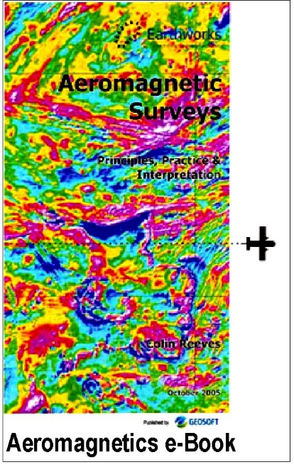
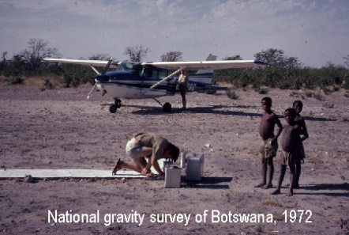
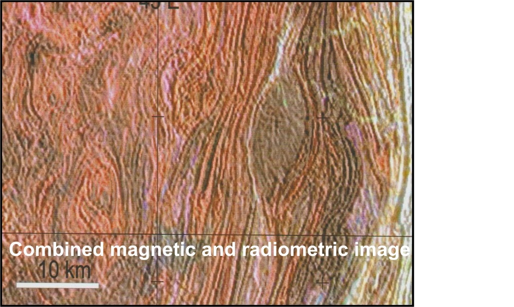
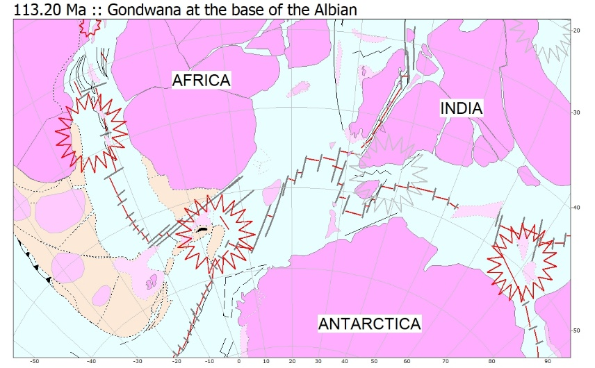
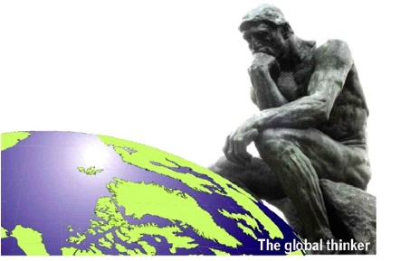

## The scientific basis of resource exploration

Systematic resource exploration starts with geological reconnaissance.
Geological mapping was therefore a priority in many countries in the first half
of the 20th century, underpinned by heroic campaigns of field mapping, supported
in due course by the interpretation of aerial photography and then of satellite
imagery in the second half of the century. The sheer size of areas to be covered
in places like Africa is daunting and the problems of tedious land access are
compounded by the paucity of bedrock exposure over large parts of most
continents.  The offshore continental margins, with their potential for oil and
gas, offer virtually no conventional exposure.

Since about 1950, airborne magnetometer surveys have shown their ability to
offer fast geological reconnaissance of large areas at low cost, regardless of
conditions on the ground. Such surveys evolved in their technological
sophistication and had been joined by high resolution gamma-ray spectrometry by
the 1990s. Airborne gravity has also gained its place amongst the most pertinent
technologies to explore what lies at depth below large areas. The economic
importance of extending geological mapping into these areas devoid of outcrop –
and into the third dimension everywhere – is probably still underestimated by
the earth science community at large. 'Geophysical mapping' is relevant at scales
from a map sheet to a continent. The procedures of geophysical mapping are at
the heart of Earthworks’ experience. An introductory text-book, [*Aeromagnetic
Surveys: Principles, Practice and Interpretation*](https://www.reeves.nl/upload/Aeromagnetic_Survey_Reeves.pdf) was
released by Geosoft in 2005.

Thorough, intelligent and informed inventory of solid mineral and hydrocarbon
prospectivity on land and at sea is essential both to the commercial resource
sector and to national and international authorities. Despite their key economic
role in this, many national geological surveys - in Africa, for example - are
still starved of resources. Aid programmes attempting to compensate for decades
of under-performance have routinely turned to airborne geophysical surveys to
accelerate the national resource mapping process by providing pre-competitive
baseline data to release to the exploration sector. Colin has been active
in this sector for more than 50 years.

## A half-century of geophysical mapping and interpretation

His approach has been to face up to this challenge squarely, starting with the
initial forays into the geology hidden below the sands of the Kalahari in
Botswana. This evolved over many years into a focus on the key role of national
geological surveys in collating, understanding and disseminating basic
geological knowledge for their territories.  Many international aid projects
have supported economic exploration in this way. Wherever possible within these
programmes Earthworks has sought to assist in institutional strengthening and
capacity building.  We argue that this starts with adopting a management
strategy that is suited to the era of information and communication technology
(ICT).  ICT must now be at the core of any public sector survey organisation
that is to remain effective as the custodian of the national geoscience
database. We have repeatedly used management consultants versed in ‘the
management of change’ to help achieve this within our projects.

The interpretation of regional geophysical surveys is a specialist skill that
demands experienced practitioners. Pre-existing geological maps and knowledge
must be the foundation of the work, but geophysical techniques always reveal
hidden structures (such as the Okavango dyke swarm in Botswana, illustrated) that not only
allow interpolation and extrapolation of known geology into covered areas but
also add the third dimension to hidden structures everywhere. The interpreter’s
skill involves developing geological ideas that not only fit the observed
geology but also make defensible arguments about what lies below, embracing the geophysical anomalies. It is fundamental to exploration programmes that such
ideas suggest locations that can be tested in more-detailed exploration work at
local scales.

At the other end of the scale spectrum, from the broad perspective afforded by
experience with national survey programmes in many countries of central,
southern and eastern Africa, it is evident that geological correlations at
continental scale drawing on these new national-scale insights are
under-developed. There is no continent-wide geological mapping authority in
Africa to match the performance of, for example, Geoscience Australia, the
Geological Survey of Canada or the USGS. With hands-on experience in so many
countries of sub-Saharan Africa, this is one focus of the current endeavours of
Earthworks. A better appreciation of the broader features of continental geology
for Africa, in turn, allows the continent to be fitted more elegantly into
larger assemblages of Precambrian terranes such as Gondwana, Pangea and Rodinia.

## The hidden two-thirds of the Earth

Most of our planet is covered by the water of the deep oceans. Their geological
history was virtually unknown until the theory of plate tectonics brought a new
dimension to earth science as a whole in the 1960s. Then, in 1997, satellite altimetry
started to deliver images of sea-floor topography of startling resolution
worldwide. The detail revealed was sufficient to interpret with confidence the
processes of ocean creation within the guidelines of plate tectonic theory.

In combination with spherical geometry, the paths by which the continents
dispersed from the Paleozoic entity of Gondwana could be traced over time with new
accuracy. Making use of this data required the adoption of
paleo-reconstruction software and postulating and evaluating continental
movements that followed logical rules to produce models that were also
satisfactory when viewed in animation.  Slowly, satisfactory models of the
dispersion of Gondwana were developed that bridged the Cretaceous Quiet Zone,
devoid of the marine magnetic anomalies used universally to time ocean growth,
and extended accurate reconstructions back into Lower Cretaceous and
Jurassic times where the story of Gondwana disruption is rooted. This work is ongoing.

With the luxury of a supply of available quality time, priority is now being
given to these curiosity-driven research activities, including support to the new [Geological Map
of Gondwana (IGCP-628)](http://www.gondwana.geologia.ufrj.br/en). Earlier contributions to basic research have included,
for example, the Magnetic Anomaly Map of the World, contributions to two
scientific encyclopaedias and many workshops and training programmes. We are
now particularly interested in cooperating with others with expertise,
experience and non-confidential data (particularly in Africa) that can be
shared with the wider earth science community to promote scientific
knowledge of the geological past in the southern hemisphere.
 

*Last update: 2021 June 16*
