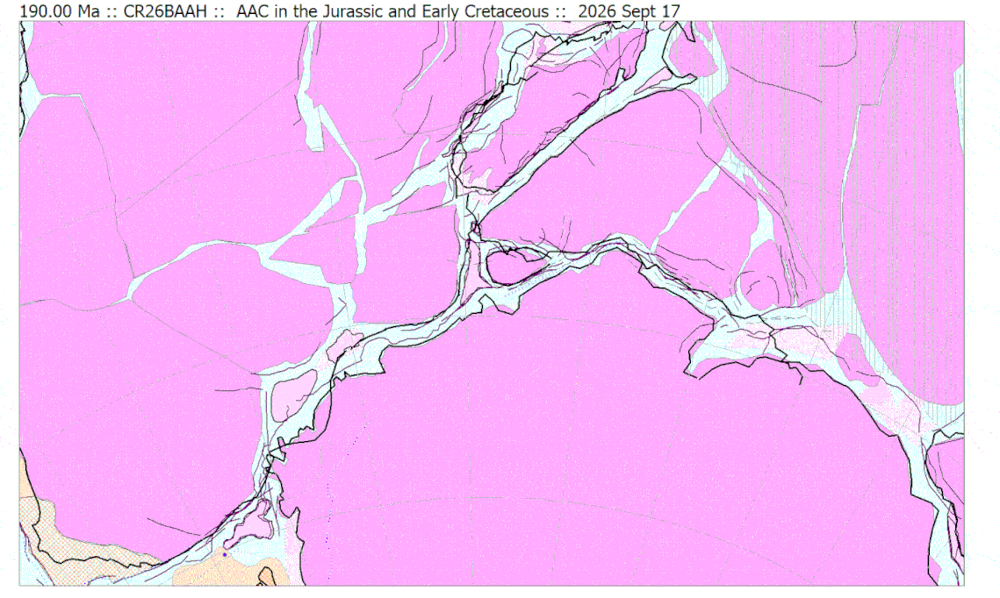

## ...in the Jurassic and Early Cretaceous

* [Select another animation](../animations)

The two largest continental fragments of Gondwana are Africa and Antarctica.  They are related directly to each other by way of only a relatively narrow strip of ocean, 500-600 km in width and about 6000 km in length. The mid-ocean ridge has remained closely central (apart from a small, early adjustment around the Beira 
High) such that the conjugate margins of northern Mozambique in Africa and Dronning Maud Land in Antarctica are virutally equidistant from present-day seismicity and topography marking the Southwest Indian Ridge within the Corridor.  Precise understanding of the geometry of the creation of this Africa-Antarctica corridor (AAC) is important as it forms part of both the two plate circuits for the dispersal of East Gondwana and West Gondwana respectively.

[new text here]

*Launched 2026 September 24*

* [Select another animation](../animations)
* [Return fo Gondwana main page](../../gondwana)
  
