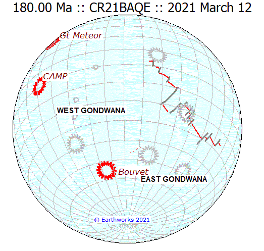

# A fixed global reference frame

Global tectonics, for Gondwana at least, is not so much about continents moving as about oceans - or their mid-ocean ridges at least - staying in the same place. 
A number of mantle plumes are thought to have remained fixed with respect to the earth's axis of rotation and hence provide a fixed referecne frame for the movements
of all the continents.  These plumes have each provided geological evidence of (a) an abrupt outbreak with copious supplies of magma at a certain time and (b) a **trail** of 
generally diminishing activity (perhaps with some reactivations from time to time) in the form of oceanic islands and submarine edifices ying on the oceanic crust.
Mid-ocean ridges, meanwhile, can be shown to have been located close to the mid-point between separating continents.  They may be modelled precisely as such and, when departures
show up, the need to investigate causes and improve the model is signalled.  The resulting model, improved incrementally over many years, is shown in the animation 
for the period from 200 Ma to the present during which the Gondwana continents dispersed. What emerges is the pattern by which the growing network of mid-ocean riddges
is rleated to the constellation of hotspots across the hemisphere that Gondwana and its oceans now occupy.
