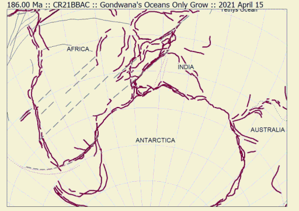

## Oceans only grow

Plate tectonics recognises only three types of plate margin: (1) *rifts* and *ridges* that created new crust, (2) *transforms* where two plates slide past each other and (3) 
*subduction zones* where
crustal material gets consumed back into the mantle.  The threshold for starting a subduction zone is high and such features hardly appear in the dispersal story of central 
Gondwana. It follows that every plate margin we model must be either type (1) or type (2). This leads to a further test that any acceptable model must pass. The growth of an 
ocean must be more-or-less continuous, in particular it must not go into reverseimplying that crust is being consumed.  There may be instances, particularly in young or 
proto-oceans, where evidence of compression may be found (e.g. flower structures onseismic setcions) but the amount of shortening will be small (less than 10 km?) on the 
scale of a global map. For the rest, once started a rift turning into an ocean will show an increase in area with time. We can demonstrate this by drawing a median line down each ocean at regular time intervals and attaching it to each of the two conjugate fragments. After a time, these two features will have separated
and a new median can be drawn.

The animation illustrates the result of such an exercise for our Gondwana dispersal model. Until 145 Ma, we have drawn a grey median line every 5 myr to show the slow 
ocean growth during Jurassic times. The 140 Ma median line, the first in Cretaceous times, is red and marks the onset of new types of dispersal activity. Spectral colours 
follow at intervals of 5 myr until 105 Ma (magenta). From the 100 Ma median line we revert to grey lines and stop at 85 Ma, by which time India has taken off from Madagascar. 
We show thick purple lines to represent the *gravity margins* we interpretfrom satellite gravity data around most continental areas. They serve as unequivocal proxies for 
continental margins at this scale.

Note in the animation that in a relatively short time interval, 135 to 125 Ma approximately, most of the outlines of the southern continents are established and (slow) rifting 
turns into (noraml) ocean growth rates that continue, in many cases to the present day. A new ridge system becomes continuous all the way from West Africa to Australia while, with a short-lived
 deviation around 130 Ma, the old-established spreading between Africa and Antarctica carries on undiminshed.
